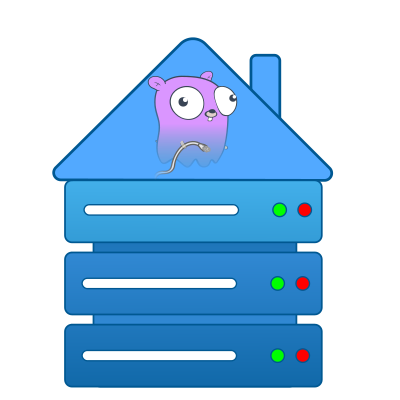

# GOstHome



This is a reimplementation of ESPHome project using Go language for easy integration with more powerful (embedded) systems.
Gosthome is designed to run on computers and servers as a system service (daemon).
It is roughly equivant to `host` ESPhome platform, but it a single binary compiled without any system dependencies.

This project is work-in-progress and in no way affiliated with Nabu Casa and ESPHome project.

## Features

* Single binary to deploy anywhere.
* Homeassistant- and ESPHome-like system of components and yaml configuration.
* Integrates with Home Assistant using ESPHome integration (uses same Native API).
* You can use it as a library to integrate in another (bigger) projects.

## What works

* Full api compatibility with ESPHome (up to native api version v1.10)
  * Client library is available for external native api use as `github.com/gosthome/gosthome/components/api/client`
* Components with entity system
  * Binary sensor domain
  * Button domain
* psutil component, showing usage statistics on the running host
* UART component, implementing a uart button
* Demo component, similar to [ESPHome's `demo:`](https://esphome.io/components/demo) with binary sensors and a button

## `gosthome` command

```
$ gosthome
NAME:
   gosthome - Control your (embedded) systems by simple yet powerful configuration files and remotely through encrypted API

USAGE:
   gosthome [global options] command [command options]

VERSION:
   0.1.0

COMMANDS:
   run   Run a configuration
   util  Utilities for configuration

GLOBAL OPTIONS:
   --verbose      (default: false) [$VERBOSE]
   --help, -h     show help
   --version, -v  print the version
```

```
NAME:
   gosthome util - Utilities for configuration

USAGE:
   gosthome util command [command options]

COMMANDS:
   mac           Generate a local MAC address to identify node
   noise         Generate a Noise PSK for encryption key
   hashpassword  Hash your password for the config file

OPTIONS:
   --help, -h  show help
```

## Example configuration

The configuration is done in a similar to ESPHome way - by writing yaml files.

```
gosthome:
  # This is a name of your node - this is how it will be shown
  # in your dashboard in Home Assistant
  name: "test"
  # mac field is used only for api communication. you can set it to
  # a mac address of your device
  mac: "<generate one for yourself using `gosthome util mac`>"

api:
  port: 6053
  encryption:
    key: "<generate one for yourself using `gosthome util noise`>"

# this example assumes that you have a device you can control
# via usb-uart, connected to device running gosthome via /dev/ttyACM0
uart:
  port: /dev/ttyACM0
  baud_rate: 115200


# this buttons are to control your device
button:
  - platform: uart
    id: "f"
    name: up
    data: "w"
  - platform: uart
    name: down
    data: "s"
  - platform: uart
    name: left
    data: "d"
  - platform: uart
    name: right
    data: "a"
  - platform: uart
    name: reset
    data: "r"
```

## Run example

## Name

I wanted to integrate Go language and ESPHome in one thing. ESP also stand *ExtraSensory Perception*, some say an ability to see _ghosts_. If you spell ghost a bit funny, you'll get *Gost*.

## Logo

Logo is using of the [networking gopher](https://github.com/egonelbre/gophers/blob/master/vector/projects/network-side.svg) by [@egonelbre](https://github.com/egonelbre).
